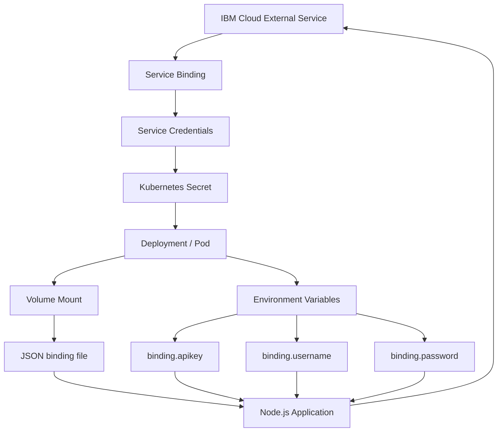

# Kubernetes Service Binding — Comprehensive Technical Notes

> **Source files:** `Service Binding.txt`, `Service Binding-subtitles-en.vtt`, and `Service Binding.mp4`
>
> **Source fidelity:** The TXT and VTT spoken content were compared after whitespace normalization and matched exactly. The complete timestamped transcript is retained near the end of this document.
>
> **Video analysis:** The provided MP4 was inspected for architectural slides, IBM Cloud service examples, CLI commands, Kubernetes Secret output, volume-mount configuration, environment-variable configuration, and the Node.js code snippet.
>
> **Added live examples:** Concrete examples are explicitly marked where the lesson gives a generic/partial command or a conceptual instruction. These additions are not represented as quotations from the lesson.

## Visual Study Diagram


> Generated visual study aid based on the supplied lesson.

---

# 1. Learning Objectives

After watching the video, you will be able to:

1. **Explain the roles and goals of service binding.**
2. **Describe how to bind a Kubernetes cluster to an external service.**
3. **Identify commands to retrieve the secrets in your Kubernetes cluster.**
4. **Describe how to use service binding in applications.**

---

# 2. What Is Service Binding?

Service binding is the process needed to consume **external services** or **backing services** in applications.

The lesson specifically includes:

- REST APIs
- Databases
- Event buses

Conceptually:

```text
Application
    |
    v
Service Binding
    |
    +---- configuration
    |
    +---- credentials
    |
    v
External / Backing Service
```

Service binding manages:

- Configuration for back-end services.
- Credentials for back-end services.
- Protection of sensitive data.
- Automatic availability of service credentials as a Kubernetes Secret.

---

# 3. Core Goals of Service Binding

The lesson presents service binding as a way to:

- Consume external/backing services.
- Manage service configuration.
- Manage service credentials.
- Protect sensitive data.
- Make service credentials automatically available as a Secret.
- Bind an external service to an application Deployment.
- Allow application code to use the bound credentials to call the corresponding service.

---

# 4. Service Binding Architecture

The lesson shows an architecture in which:

```text
External Service
       |
       | Service Binding
       v
Kubernetes Cluster
       |
       v
Kubernetes Secret
       |
       v
Deployment / Application
       |
       v
Application uses credentials
       |
       v
External Service API
```

The binding connects the application deployment to an external service while managing the credentials through a Kubernetes Secret.

---

# 5. What Happens During Service Binding?

The lesson explains the process as follows:

1. The external service is bound to the application's Deployment.
2. Service binding creates/provides service credentials.
3. The credentials are stored in a Kubernetes Secret.
4. The application accesses those credentials.
5. The application code uses the credentials to call the corresponding service.

---

# 6. IBM Cloud Service Binding Example

The lesson uses an **IBM Cloud service** as the main example.

IBM Cloud service binding:

- Quickly creates service credentials for an IBM Cloud service.
- Uses an IBM public cloud service endpoint.
- Stores or binds the service credentials into a Kubernetes Secret in the cluster.

The basic flow is:

```text
IBM Cloud Service
       |
       v
Provision Service Instance
       |
       v
Bind Service to Kubernetes Cluster
       |
       v
Service Credentials Created
       |
       v
Kubernetes Secret
       |
       v
Application
```

---

# 7. Four Main Steps to Bind an IBM Cloud Service

The lesson describes four steps.

## Step 1 — Provision the Service Instance

Provision an instance of the external service.

The lesson says this can be done either:

- Using the IBM Cloud command-line interface.
- Using the IBM Cloud catalog on the IBM Cloud website.

## Step 2 — Bind the Service to the Cluster

Bind the newly created service instance to the Kubernetes cluster.

The service binding creates service credentials using the public cloud service endpoint.

## Step 3 — Store the Credentials in a Kubernetes Secret

IBM Cloud Service Binding automatically creates a Kubernetes Secret containing the service credentials.

The lesson says the credentials of a service instance are:

- Base64 encoded.
- Stored inside the Secret.
- Represented in JSON format.

## Step 4 — Configure the Application

Configure the application to access the credentials stored in the Kubernetes Secret.

The application can consume the Secret using:

- A mounted volume.
- Environment variables.

---

# 8. IBM Cloud Catalog

The IBM Cloud catalog provides a variety of services.

The lesson mentions examples such as:

- Visual Recognition
- Natural Language Processing
- Creating chat bots

For this lesson, the selected service is **Tone Analyzer**.

---

# 9. IBM Watson Tone Analyzer Example

The lesson uses the **Tone Analyzer** service to demonstrate service binding.

The Tone Analyzer service:

- Uses linguistic analysis.
- Detects tone in a given text.
- Provides a JavaScript SDK.

The video highlights the Tone Analyzer service in the IBM Cloud services catalog.

The lesson says the service can be bound to the application Deployment so that the service credentials become automatically available.

Then:

```text
Node.js Application
       |
       v
Binding credentials
       |
       v
Tone Analyzer service
       |
       v
Text tone analysis
```

---

# 10. Provision the IBM Cloud Service Instance

The lesson's first code step is provisioning the service instance through the CLI.

The video shows the command:

```bash
ibmcloud resource service-instance-create upkar-tone-analyzer tone-analyzer standard us-south
```

The command creates the service instance:

```text
upkar-tone-analyzer
```

using the IBM Cloud service:

```text
tone-analyzer
```

with:

```text
Plan: standard
Region: us-south
```

The output shown in the video indicates:

```text
Creating service instance upkar-tone-analyzer ...
OK
Service instance upkar-tone-analyzer was created.
```

### Live example

```bash
ibmcloud resource service-instance-create my-tone-analyzer tone-analyzer standard us-south
```

> **Added live example:** This uses the lesson's structure with a different service-instance name so it can be adapted to a personal IBM Cloud account.

---

# 11. Binding the Service Instance to the Kubernetes Cluster

The video shows the IBM Cloud Kubernetes service-binding command:

```bash
ibmcloud ks cluster-service-bind --cluster upkar_cluster --namespace default --service upkar-tone-analyzer
```

The output shown includes:

```text
Binding service instance to namespace...
OK

Namespace: default
Secret Name: binding-upkar-tone-analyzer
```

The binding therefore creates a Kubernetes Secret associated with the namespace.

### Live example

```bash
ibmcloud ks cluster-service-bind \
  --cluster my-cluster \
  --namespace default \
  --service my-tone-analyzer
```

> **Added live example:** Same operation with example cluster/service names.

---

# 12. What the Binding Creates

The lesson says IBM Cloud Service Binding automatically creates a Kubernetes Secret with the service credentials.

The Secret contains credentials associated with the service instance.

The video shows a Secret similar to:

```text
binding-upkar-tone-analyzer
```

The Secret is in:

```text
Namespace: default
```

The credentials are stored as encoded data.

---

# 13. Credential Encoding

The lesson states that service-instance credentials are:

```text
Base64 encoded
```

and stored:

```text
inside the Secret
```

in:

```text
JSON format
```

Conceptually:

```text
Service credentials
        |
        v
JSON representation
        |
        v
Base64 encoding
        |
        v
Kubernetes Secret
```

> **Source-fidelity note:** The lesson specifically describes the credential representation as Base64 encoded JSON. The document preserves that wording without adding external claims about encryption.

---

# 14. Verify the Secret in the Kubernetes Cluster

The video shows the following command:

```bash
kubectl get secrets --namespace=default
```

The output contains:

```text
NAME
binding-upkar-tone-analyzer

TYPE
Opaque

DATA
1
```

### Live example

```bash
kubectl get secrets --namespace=default
```

This verifies that the service-binding Secret exists in the cluster.

---

# 15. Retrieving Secrets Through Other Interfaces

The lesson says the same Secrets can also be retrieved through:

- The Kubernetes Dashboard user interface.
- IBM Cloud Kubernetes Service.

So the retrieval options are:

```text
kubectl CLI
    OR
Kubernetes Dashboard
    OR
IBM Cloud Kubernetes Service
```

---

# 16. How to Consume the Service-Binding Secret

The lesson gives two methods.

## Method 1 — Mount the Secret as a Volume

Mount the Secret as a volume to the Pod.

This creates a JSON-formatted file named:

```text
binding
```

The file is stored in the volume-mount directory.

The `binding` file includes:

- Service information.
- Service credentials.
- The information needed to access the IBM Cloud service.

## Method 2 — Reference the Secret Through Environment Variables

The Secret can also be referenced using environment variables.

The lesson identifies these binding-related variables:

```text
binding.apikey
binding.username
binding.password
```

These correspond to the Tone Analyzer service's:

- API key
- Username
- Password

---

# 17. Method 1 — Mount the Secret as a Volume

The video shows the volume-mount configuration:

```yaml
volumeMounts:
  - mountPath: /opt/service-bind
    name: service-bind-volume

volumes:
  - name: service-bind-volume
    secret:
      defaultMode: 420
      secretName: binding-tone
```

The mounted Secret is available at:

```text
/opt/service-bind
```

The volume name is:

```text
service-bind-volume
```

The Secret name shown in this configuration is:

```text
binding-tone
```

The lesson comments that the Secret name comes from the `kubectl get secrets` command.

> **Source-fidelity note:** The video uses `binding-tone` in the volume example, while an earlier binding output shows `binding-upkar-tone-analyzer`. These are retained as separate observed states from the video.

---

# 18. What the Mounted Secret Looks Like

When the Secret is mounted as a volume, the lesson says it creates a JSON-formatted file named:

```text
binding
```

A conceptual directory looks like:

```text
/opt/service-bind/
└── binding
```

The application can read that file and parse the JSON credentials.

---

# 19. Method 2 — Environment Variables

The video shows a slide titled:

> Configure your app using the Secret

with these binding values:

```text
binding.apikey
binding.username
binding.password
```

The application accesses those credentials through environment variables.

The lesson says these correspond to the API key, username, and password of the Watson Tone Analyzer service instance.

---

# 20. Node.js Application Example

The video shows a Node.js application using the service binding.

The displayed code is structurally similar to:

```javascript
const ToneAnalyzerV3 = require('ibm-watson/tone-analyzer/v3');
const { IamAuthenticator } = require('ibm-watson/auth');

var binding = JSON.parse(
  fs.readFileSync('/opt/service-bind/binding', 'utf8')
);

const tone_analyzer = binding['binding-apikey']
  ? new ToneAnalyzerV3({
      authenticator: new IamAuthenticator({
        apikey: binding.apikey
      }),
      url: binding.url,
      version: '2016-05-19'
    })
  : new ToneAnalyzerV3({
      username: binding.username,
      password: binding.password,
      url: binding.url,
      version: '2016-05-19'
    });
```

> **Video-code fidelity note:** The source screenshot is low-resolution. The code structure and credential fields are reproduced from what is visibly readable, while unreadable details are not silently invented.

---

# 21. Application Credential Flow

For a volume-mounted binding:

```text
Kubernetes Secret
       |
       v
Secret volume
       |
       v
/opt/service-bind/binding
       |
       v
JSON.parse(...)
       |
       +--> binding.apikey
       +--> binding.username
       +--> binding.password
       +--> binding.url
       |
       v
Tone Analyzer client
       |
       v
Watson Tone Analyzer API
```

For environment variables:

```text
Kubernetes Secret
       |
       v
Environment variables
       |
       +--> binding.apikey
       +--> binding.username
       +--> binding.password
       |
       v
Node.js application
       |
       v
Tone Analyzer service
```

---

# 22. Service Binding and the Deployment

The lesson specifically says service binding binds the external service to a **Deployment**.

Conceptually:

```text
IBM Cloud Service
       |
       v
Service Binding
       |
       v
Kubernetes Secret
       |
       v
Deployment
       |
       v
Pod
       |
       v
Application code
```

The application then uses the credentials from the binding to call the service.

---

# 23. Practical Real-Life Scenario

## Scenario: Node.js Customer-Feedback Analyzer

Imagine a company has a Node.js application called:

```text
customer-feedback-api
```

Customers submit feedback such as:

```text
"The delivery was very fast, but the packaging could be better."
```

The company wants to send that text to IBM Watson Tone Analyzer and display the detected tone.

Instead of hard-coding:

- API key
- Username
- Password
- Service URL

inside the Node.js application, the team uses **IBM Cloud Service Binding**.

### Architecture

```text
Customer
   |
   v
Node.js / Express application
   |
   v
Service Binding credentials
   |
   v
Kubernetes Secret
   |
   v
IBM Watson Tone Analyzer
   |
   v
Tone analysis result
   |
   v
Application response
```

---

# 24. Practical Scenario — Step 1: Provision the Service

### Command

```bash
ibmcloud resource service-instance-create customer-feedback-tone \
  tone-analyzer standard us-south
```

### What it does

Creates:

```text
Service instance:
customer-feedback-tone
```

using:

```text
Service: tone-analyzer
Plan: standard
Region: us-south
```

### Expected conceptual result

```text
Service instance customer-feedback-tone was created.
```

---

# 25. Practical Scenario — Step 2: Bind the Service to Kubernetes

Assume the cluster is:

```text
customer-prod
```

and the Kubernetes namespace is:

```text
default
```

### Command

```bash
ibmcloud ks cluster-service-bind \
  --cluster customer-prod \
  --namespace default \
  --service customer-feedback-tone
```

### Result

IBM Cloud Service Binding creates a Secret containing the service credentials.

Conceptually:

```text
IBM Cloud Service
        |
        v
customer-feedback-tone
        |
        v
Kubernetes Secret
        |
        v
default namespace
```

---

# 26. Practical Scenario — Step 3: Verify the Secret

### Command

```bash
kubectl get secrets --namespace=default
```

### Expected conceptual result

```text
NAME
binding-customer-feedback-tone

TYPE
Opaque

DATA
1
```

The exact generated Secret name can depend on the binding operation; use the name returned by the binding command.

---

# 27. Practical Scenario — Step 4A: Consume the Secret as a Volume

Suppose the team wants the binding file mounted inside the application container.

### Deployment fragment

```yaml
apiVersion: apps/v1
kind: Deployment
metadata:
  name: customer-feedback-api
spec:
  replicas: 2
  selector:
    matchLabels:
      app: customer-feedback-api
  template:
    metadata:
      labels:
        app: customer-feedback-api
    spec:
      containers:
        - name: customer-feedback-api
          image: customer-feedback-api:1.0
          volumeMounts:
            - mountPath: /opt/service-bind
              name: service-bind-volume
      volumes:
        - name: service-bind-volume
          secret:
            secretName: binding-customer-feedback-tone
            defaultMode: 420
```

The application can then read:

```text
/opt/service-bind/binding
```

---

# 28. Practical Scenario — Step 4B: Consume the Secret Using Environment Variables

The lesson also presents environment variables as an alternative.

A practical Deployment pattern is:

```yaml
apiVersion: apps/v1
kind: Deployment
metadata:
  name: customer-feedback-api
spec:
  replicas: 2
  selector:
    matchLabels:
      app: customer-feedback-api
  template:
    metadata:
      labels:
        app: customer-feedback-api
    spec:
      containers:
        - name: customer-feedback-api
          image: customer-feedback-api:1.0
          env:
            - name: BINDING_APIKEY
              valueFrom:
                secretKeyRef:
                  name: binding-customer-feedback-tone
                  key: apikey
            - name: BINDING_USERNAME
              valueFrom:
                secretKeyRef:
                  name: binding-customer-feedback-tone
                  key: username
            - name: BINDING_PASSWORD
              valueFrom:
                secretKeyRef:
                  name: binding-customer-feedback-tone
                  key: password
```

> **Added live example:** This demonstrates the general Kubernetes `secretKeyRef` pattern. The lesson itself focuses on the binding-provided values `binding.apikey`, `binding.username`, and `binding.password` rather than showing this complete Kubernetes environment-variable YAML.

---

# 29. Practical Scenario — Step 5: Node.js Application

A simplified application can consume credentials and call the Tone Analyzer SDK:

```javascript
const fs = require('fs');
const express = require('express');
const ToneAnalyzerV3 = require('ibm-watson/tone-analyzer/v3');
const { IamAuthenticator } = require('ibm-watson/auth');

const app = express();

const binding = JSON.parse(
  fs.readFileSync('/opt/service-bind/binding', 'utf8')
);

const toneAnalyzer = new ToneAnalyzerV3({
  authenticator: new IamAuthenticator({
    apikey: binding.apikey
  }),
  url: binding.url,
  version: '2016-05-19'
});

app.get('/analyze', async (req, res) => {
  const text = req.query.text || 'The delivery was fast but packaging was poor.';

  const result = await toneAnalyzer.tone({
    toneInput: { text },
    contentType: 'application/json'
  });

  res.json(result.result);
});

app.listen(3000, () => {
  console.log('Customer feedback API running on port 3000');
});
```

> **Added live example:** This is a practical implementation based on the lesson's Node.js/Tone Analyzer concept. It is not claimed to be the exact source code shown in the video.

---

# 30. Practical Scenario — End-to-End Command Sequence

## Command table

| Step | Purpose | Command |
|---|---|---|
| 1 | Create IBM Cloud service instance | `ibmcloud resource service-instance-create customer-feedback-tone tone-analyzer standard us-south` |
| 2 | Bind service to Kubernetes cluster | `ibmcloud ks cluster-service-bind --cluster customer-prod --namespace default --service customer-feedback-tone` |
| 3 | Verify binding Secret | `kubectl get secrets --namespace=default` |
| 4 | Deploy application | `kubectl apply -f customer-feedback-api.yaml` |
| 5 | Run/verify application | Use the deployed application's endpoint or service according to the deployment configuration. |

### Step 1

```bash
ibmcloud resource service-instance-create customer-feedback-tone \
  tone-analyzer standard us-south
```

### Step 2

```bash
ibmcloud ks cluster-service-bind \
  --cluster customer-prod \
  --namespace default \
  --service customer-feedback-tone
```

### Step 3

```bash
kubectl get secrets --namespace=default
```

### Step 4

```bash
kubectl apply -f customer-feedback-api.yaml
```

> **Added live example:** The `kubectl apply` command is a practical deployment step added to turn the lesson's configuration workflow into an executable scenario. The lesson itself focuses on binding and retrieving the Secret rather than showing this exact application-deployment command.

---

# 31. Practical Scenario — Verification Flow

After deployment:

```text
1. Provision service
        |
        v
2. Bind service
        |
        v
3. Secret appears
        |
        v
4. Verify Secret
        |
        v
5. Configure application
        |
        +---- volume mount
        |
        OR
        |
        +---- environment variables
        |
        v
6. Application reads credentials
        |
        v
7. Application calls Tone Analyzer
        |
        v
8. Application returns tone analysis
```

---

# 32. Command Reference

## IBM Cloud Commands

| Purpose | Command | What it does |
|---|---|---|
| Create service instance | `ibmcloud resource service-instance-create ...` | Provisions the IBM Cloud service instance. |
| Bind service instance | `ibmcloud ks cluster-service-bind ...` | Binds the service to a Kubernetes cluster/namespace and creates service credentials. |

### Create service instance

```bash
ibmcloud resource service-instance-create <instance-name> <service-name> <plan> <region>
```

### Live example

```bash
ibmcloud resource service-instance-create my-tone-analyzer tone-analyzer standard us-south
```

### Bind service

```bash
ibmcloud ks cluster-service-bind \
  --cluster <cluster-name> \
  --namespace <namespace> \
  --service <service-instance-name>
```

### Live example

```bash
ibmcloud ks cluster-service-bind \
  --cluster my-cluster \
  --namespace default \
  --service my-tone-analyzer
```

---

# 33. Kubernetes Commands

| Purpose | Command | Live example |
|---|---|---|
| List Secrets | `kubectl get secrets --namespace=default` | `kubectl get secrets --namespace=default` |
| Inspect a specific Secret | Generic `kubectl describe secret ...` pattern | `kubectl describe secret binding-customer-feedback-tone --namespace=default` |
| Apply application YAML | Added practical deployment step | `kubectl apply -f customer-feedback-api.yaml` |

> The lesson explicitly introduces the Secret retrieval command through `kubectl get secrets`. The `describe` and `apply` examples above are clearly marked as practical additions rather than source quotations.

---

# 34. Half-Filled / Generic Commands → Live Examples

The lesson says:

> “The Get Secrets command shows all the secrets in your Kubernetes cluster.”

### Live example

```bash
kubectl get secrets --namespace=default
```

The lesson says:

> “you can retrieve the same secrets in the Kubernetes dashboard user interface”

This is a UI workflow rather than a CLI command.

The lesson also says:

> “use a volume for the secret with a corresponding volume mount.”

### Live YAML example

```yaml
volumeMounts:
  - mountPath: /opt/service-bind
    name: service-bind-volume

volumes:
  - name: service-bind-volume
    secret:
      defaultMode: 420
      secretName: binding-customer-feedback-tone
```

The lesson says:

> “you can reference the secret in environment variables.”

### Live YAML example

```yaml
env:
  - name: BINDING_APIKEY
    valueFrom:
      secretKeyRef:
        name: binding-customer-feedback-tone
        key: apikey
```

---

# 35. Important Secret Names Observed in the Video

The video shows more than one name in different examples.

| Context | Name shown |
|---|---|
| Service-binding output after bind | `binding-upkar-tone-analyzer` |
| Volume-mount configuration | `binding-tone` |

These are retained exactly as separate video-observed states.

---

# 36. Important Environment / Binding Values

The lesson identifies:

```text
binding.apikey
binding.username
binding.password
```

These correspond to:

| Binding value | Meaning |
|---|---|
| `binding.apikey` | API key for the service. |
| `binding.username` | Service username. |
| `binding.password` | Service password. |

The lesson says the sample Node.js application uses these values inside an Express.js application deployed to IBM Cloud Kubernetes Service.

---

# 37. Service Binding Architecture — Detailed



---

# 38. Why Service Binding Is Useful

The lesson's central idea can be summarized as:

```text
Without binding:
Application code
    |
    +--> hard-coded service credentials
    |
    +--> direct service configuration

With service binding:
Application
    |
    +--> reads credentials supplied by binding
    |
    v
Kubernetes Secret
    |
    v
External service
```

Service binding separates service-specific configuration and credentials from application logic.

---

# 39. Configuring an Application — Two Paths

```text
                         Kubernetes Secret
                                |
                   +------------+------------+
                   |                         |
                   v                         v
             Volume Mount              Environment Variables
                   |                         |
                   v                         v
        /opt/service-bind/binding     binding.apikey
                   |                  binding.username
                   |                  binding.password
                   v                         |
             JSON parsing                    |
                   |                         |
                   +------------+------------+
                                |
                                v
                         Node.js application
                                |
                                v
                       Watson Tone Analyzer
```

---

# 40. Security and Credential Handling

The lesson emphasizes that service binding manages:

- Configuration.
- Credentials.
- Sensitive information.

Credentials are stored in a Kubernetes Secret and can then be consumed through:

```text
Volume mount
       OR
Environment variables
```

The lesson specifically says the binding process protects sensitive data while making required service credentials available to the application.

---

# 41. Complete Lesson Flow

```text
                 SERVICE BINDING
                        |
                        v
             Consume external service
                        |
                        v
              IBM Cloud service
                        |
                        v
               Provision instance
                        |
                        v
              Bind to Kubernetes
                        |
                        v
             Credentials generated
                        |
                        v
              Kubernetes Secret
                        |
             +----------+----------+
             |                     |
             v                     v
        Volume mount         Environment variables
             |                     |
             v                     v
       binding JSON file    binding.apikey
                            binding.username
                            binding.password
             |                     |
             +----------+----------+
                        |
                        v
                  Application
                        |
                        v
              External service API
```

---

# 42. Recap

The lesson concludes:

- Binding an external service to a Deployment automatically provides the credentials needed to use the service inside application code.
- Credentials are stored as a Secret.
- The Secret can be consumed using volume mounts and volumes.
- Service binding manages configuration and credentials for back-end services while protecting sensitive data.
- The application can use the credentials either:
  - by mounting the Secret as a volume to the Pod, or
  - by referencing the Secret in environment variables.

---

# 43. Complete Timestamped Transcript

> This section preserves the complete spoken transcript from the supplied VTT. It is reflowed into timestamped blocks for readability without omitting the source content.

**00:00:06.240 → 00:00:08.940**

Welcome to Service Binding.

**00:00:08.940 → 00:00:10.620**

After watching this video,

**00:00:10.620 → 00:00:12.780**

you will be able to explain

**00:00:12.780 → 00:00:15.300**

the roles and goals of service binding.

**00:00:15.300 → 00:00:17.850**

Describe how to bind a Kubernetes cluster

**00:00:17.850 → 00:00:19.460**

to an external service.

**00:00:19.460 → 00:00:21.440**

Identify commands to retrieve

**00:00:21.440 → 00:00:23.830**

the secrets in your Kubernetes cluster,

**00:00:23.830 → 00:00:28.060**

and describe how to use service binding in apps.

**00:00:28.060 → 00:00:30.725**

What is service binding?

**00:00:30.725 → 00:00:33.150**

Service binding is the process needed to

**00:00:33.150 → 00:00:36.030**

consume external services or backing services,

**00:00:36.030 → 00:00:37.960**

including REST APIs,

**00:00:37.960 → 00:00:41.690**

databases, and event buses in our applications.

**00:00:41.690 → 00:00:45.030**

Service binding manages configuration and credentials

**00:00:45.030 → 00:00:48.490**

for back end services while protecting sensitive data.

**00:00:48.490 → 00:00:50.630**

In addition, service binding makes

**00:00:50.630 → 00:00:52.090**

service credentials available to

**00:00:52.090 → 00:00:54.310**

you automatically as a secret.

**00:00:54.310 → 00:00:56.990**

Service binding consumes the external service

**00:00:56.990 → 00:00:59.370**

by binding the application to a deployment.

**00:00:59.370 → 00:01:02.430**

Then the application code uses the credentials

**00:01:02.430 → 00:01:05.670**

from the binding and calls the corresponding service.

**00:01:05.670 → 00:01:09.130**

Here, you can see an architectural diagram that

**00:01:09.130 → 00:01:10.310**

illustrates the binding of

**00:01:10.310 → 00:01:13.390**

a Kubernetes cluster to an external service.

**00:01:13.390 → 00:01:15.870**

Next, let's learn the steps

**00:01:15.870 → 00:01:18.810**

required to bind the service to your application.

**00:01:18.810 → 00:01:21.770**

Let's use an IBM Cloud Service example.

**00:01:21.770 → 00:01:23.610**

Service binding quickly create

**00:01:23.610 → 00:01:26.490**

service credentials for an IBM Cloud service.

**00:01:26.490 → 00:01:28.870**

You create the service credentials using

**00:01:28.870 → 00:01:31.410**

IBM's Public Cloud service endpoint,

**00:01:31.410 → 00:01:33.290**

and then store or bind

**00:01:33.290 → 00:01:34.750**

your service credentials in

**00:01:34.750 → 00:01:37.270**

a Kubernetes secret in your cluster.

**00:01:37.270 → 00:01:41.085**

Here's how to bind an IBM Cloud service to your cluster.

**00:01:41.085 → 00:01:44.540**

First, you provision an instance of the service.

**00:01:44.540 → 00:01:47.800**

Then you bind the service to your cluster to create

**00:01:47.800 → 00:01:49.640**

service credentials for your service

**00:01:49.640 → 00:01:52.300**

that use the public cloud service endpoint.

**00:01:52.300 → 00:01:56.455**

Next, store the credentials in a Kubernetes secret.

**00:01:56.455 → 00:01:59.140**

Finally, you configure your app to

**00:01:59.140 → 00:02:02.220**

access the service credentials in the Kubernetes secret.

**00:02:02.220 → 00:02:04.160**

The IBM Cloud catalog

**00:02:04.160 → 00:02:06.520**

provides various services that range from

**00:02:06.520 → 00:02:09.500**

visual recognition to natural language processing

**00:02:09.500 → 00:02:11.340**

and creating chat bots.

**00:02:11.340 → 00:02:14.300**

We are using the tone analyzer service

**00:02:14.300 → 00:02:15.940**

to explain binding.

**00:02:15.940 → 00:02:18.600**

This service uses linguistic analysis

**00:02:18.600 → 00:02:20.900**

to detect tone in a given text.

**00:02:20.900 → 00:02:24.460**

The service provides an SDK in Java script.

**00:02:24.460 → 00:02:26.800**

You bind the service to the deployment

**00:02:26.800 → 00:02:29.700**

so that the credentials are automatically available.

**00:02:29.700 → 00:02:31.900**

The code then uses the credentials from

**00:02:31.900 → 00:02:35.605**

the binding and calls the tone analyzer service.

**00:02:35.605 → 00:02:38.040**

Now that you know the steps,

**00:02:38.040 → 00:02:39.855**

let's examine some code.

**00:02:39.855 → 00:02:41.870**

In the first step, provision

**00:02:41.870 → 00:02:43.390**

an instance of the service by

**00:02:43.390 → 00:02:44.970**

creating the service instance

**00:02:44.970 → 00:02:47.170**

using the command line interface.

**00:02:47.170 → 00:02:50.110**

You can also provision an instance of the service

**00:02:50.110 → 00:02:53.630**

by using the catalog on the IBM Cloud website.

**00:02:53.630 → 00:02:55.950**

In the second step, you bind

**00:02:55.950 → 00:02:57.910**

this newly created service instance to

**00:02:57.910 → 00:03:01.070**

your cluster by using the service bind command.

**00:03:01.070 → 00:03:03.830**

IBM Cloud Service Binding automatically

**00:03:03.830 → 00:03:07.450**

creates a Kubernetes secret with the service credentials.

**00:03:07.450 → 00:03:11.090**

The credentials of a service instance are base 64

**00:03:11.090 → 00:03:15.125**

encoded and stored inside your secret in the JSON format.

**00:03:15.125 → 00:03:18.200**

Now that the service is bound to your cluster,

**00:03:18.200 → 00:03:20.320**

here in Step 3,

**00:03:20.320 → 00:03:22.640**

you can verify your secret object.

**00:03:22.640 → 00:03:25.040**

The Get Secrets command shows

**00:03:25.040 → 00:03:27.505**

all the secrets in your Kubernetes cluster.

**00:03:27.505 → 00:03:29.280**

Or you can retrieve

**00:03:29.280 → 00:03:30.200**

the same secrets in

**00:03:30.200 → 00:03:32.440**

the Kubernetes dashboard user interface,

**00:03:32.440 → 00:03:35.655**

as well as on the IBM Cloud Kubernetes service.

**00:03:35.655 → 00:03:38.080**

To access the data in your secret,

**00:03:38.080 → 00:03:40.440**

choose one of the following options.

**00:03:40.440 → 00:03:43.400**

Mount the secret as a volume to your Pod,

**00:03:43.400 → 00:03:46.640**

based on the specifications provided in Step 1.

**00:03:46.640 → 00:03:49.740**

This action creates a JSON formatted file

**00:03:49.740 → 00:03:51.280**

named binding that is

**00:03:51.280 → 00:03:53.590**

stored in the Volume Mounts directory.

**00:03:53.590 → 00:03:57.000**

The binding file includes all information and credentials

**00:03:57.000 → 00:04:00.250**

required to access the IBM Cloud Service.

**00:04:00.250 → 00:04:04.660**

Or you can reference the secret in environment variables.

**00:04:04.660 → 00:04:08.120**

The environment variables binding, API key,

**00:04:08.120 → 00:04:12.300**

binding.username, and binding.password,

**00:04:12.300 → 00:04:16.740**

correspond to the API Key username and password of

**00:04:16.740 → 00:04:19.380**

the Watson Tone analyzer service instance

**00:04:19.380 → 00:04:21.380**

created in the previous step.

**00:04:21.380 → 00:04:24.950**

The displayed code snippet shows a sample node.js

**00:04:24.950 → 00:04:27.860**

application using the binding.API

**00:04:27.860 → 00:04:30.460**

Key, the binding.username,

**00:04:30.460 → 00:04:34.990**

and the binding.password environment variable inside an

**00:04:34.990 → 00:04:37.610**

express.JS application that will be

**00:04:37.610 → 00:04:40.770**

deployed to the IBM Cloud Kubernetes Service.

**00:04:40.770 → 00:04:42.590**

In this video, you'll learn

**00:04:42.590 → 00:04:44.710**

that binding an external service to

**00:04:44.710 → 00:04:46.570**

your deployment automatically provides

**00:04:46.570 → 00:04:49.500**

the credentials to use the service inside the code.

**00:04:49.500 → 00:04:52.090**

Credentials are stored as a secret that can be

**00:04:52.090 → 00:04:54.990**

consumed using volume mounts and volumes.

**00:04:54.990 → 00:04:57.870**

Binding manages configuration and credentials for

**00:04:57.870 → 00:05:01.170**

back end services while protecting sensitive data,

**00:05:01.170 → 00:05:03.130**

and you can configure your app to

**00:05:03.130 → 00:05:05.310**

use the credentials stored in the secret,

**00:05:05.310 → 00:05:07.690**

either by mounting the secret as a volume to

**00:05:07.690 → 00:05:09.550**

your pod or by referencing

**00:05:09.550 → 00:05:12.530**

the secret in environment variables.

---

# 44. Source and Fidelity Notes

## Files analyzed

| File | Purpose |
|---|---|
| `Service Binding.txt` | Source transcript text. |
| `Service Binding-subtitles-en.vtt` | Timestamped subtitle transcript. |
| `Service Binding.mp4` | Video inspected for slides, commands, Secret output, YAML, architecture, and code. |

## Transcript validation

- TXT character count: **4,550**.
- VTT cue count: **115**.
- TXT and VTT spoken text: **exact match after whitespace normalization**.
- VTT begins around **00:00:06.240**.
- Final VTT cue ends around **00:05:12.530**.
- Video duration: approximately **315.23 seconds** (about **5:15.23**).
- Video dimensions: **428 × 240**.
- Frame rate: **30 fps**.
- Video codec: **H.264**.
- Audio codec: **AAC**.

## Video details incorporated

The video was inspected for:

- Service-binding roles and goals slide.
- IBM Service Binding explanation slide.
- IBM Cloud Services catalog.
- Tone Analyzer service card.
- Service-instance provisioning command.
- Kubernetes service-binding command.
- Resulting Secret name.
- `kubectl get secrets --namespace=default`.
- Secret details shown through the Kubernetes interface.
- Secret volume-mount configuration.
- Environment-variable binding values.
- Node.js / Tone Analyzer code snippet.
- Recap.

## Exact source-observed commands

```bash
ibmcloud resource service-instance-create upkar-tone-analyzer tone-analyzer standard us-south
```

```bash
ibmcloud ks cluster-service-bind --cluster upkar_cluster --namespace default --service upkar-tone-analyzer
```

```bash
kubectl get secrets --namespace=default
```

## Source fidelity and ambiguity

The video and narration contain details that are visually or verbally presented in different forms. These are kept separate rather than silently reconciled.

Examples:

- The service-binding Secret shown immediately after the bind operation is `binding-upkar-tone-analyzer`.
- The later volume-mount YAML uses `binding-tone`.
- The source describes the credentials as Base64 encoded and stored in JSON format.
- The video code slide is low-resolution; only visibly readable structure and fields have been reproduced.
- Any practical examples added by this document are clearly labeled and are not represented as source quotations.

## Added practical scenario

The real-life scenario uses the same lesson concepts:

1. Provision an IBM Watson Tone Analyzer service.
2. Bind the service to a Kubernetes cluster.
3. Verify the generated Secret.
4. Consume the Secret through a volume mount.
5. Optionally consume credentials through environment variables.
6. Build a Node.js/Express application that uses the binding.
7. Call the Tone Analyzer service from the application.

The additional deployment command and complete application examples are practical additions intended to turn the lesson's conceptual workflow into an executable implementation.
